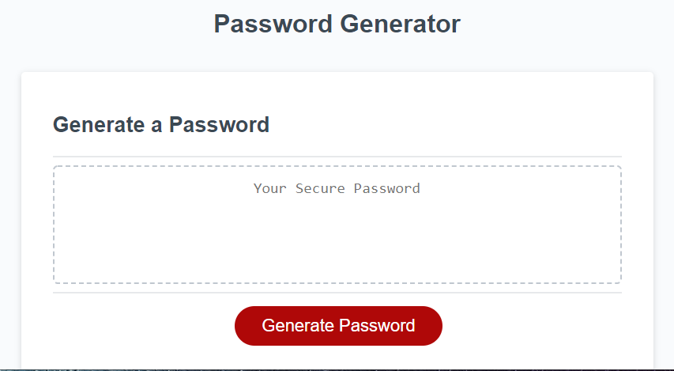

# Password Generator

## Table of Contents

- [Description](#Description)
- [Usage](#Usage)
- [Link](#Link)
- [Visuals](#Visual)

## Description
This website will generate a random password. It allows you to decide the requirements of the password. You can choose between lowercase character, uppercase character, numbers and 10 special characters. The code is designed to give you at least one of every choice selected. 

## Usage
1. Click on Generate Password.
2. Select how long you want your password to be.
3. Password has to between 8 and 128 characters.
4. When prompted about what password requirements, select OK for yes or select Cancel for no.
5. The password will be generated when all questions are answered.
6. If the box display Please try again, click on the generate password button and restart the steps.

## Link
[Link to password generator] (https://wparker05.github.io/password-generator/)

## Visual
